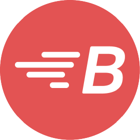

## About me
```yaml
{
   personal: {
        name: "Spencer Pruett",
        location: "Silver Spring, MD",
        education: "Bachelor's in Physics w/ minors in Math and Chemistry and Concentration in Scientific Computing"
    },
    fields_of_interest: [
        "Machine Learning",
        "Data Sceince",
        "Scientific Modeling",
        
    ],
    technical_background: [
        "Software Developer in Test",
        "Intern - Full Stack Software Developer",
        "Intern - Machine Learning in Physics Researcher"
    ]
}
```

## Some tools I've used and learned





<!--
**pruett1/pruett1** is a ✨ _special_ ✨ repository because its `README.md` (this file) appears on your GitHub profile.

Here are some ideas to get you started:

- 🔭 I’m currently working on ...
- 🌱 I’m currently learning ...
- 👯 I’m looking to collaborate on ...
- 🤔 I’m looking for help with ...
- 💬 Ask me about ...
- 📫 How to reach me: ...
- 😄 Pronouns: ...
- ⚡ Fun fact: ...
-->
